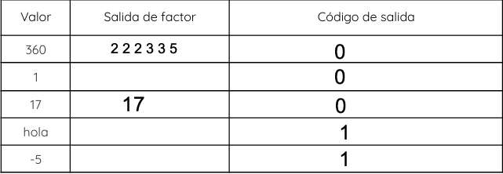
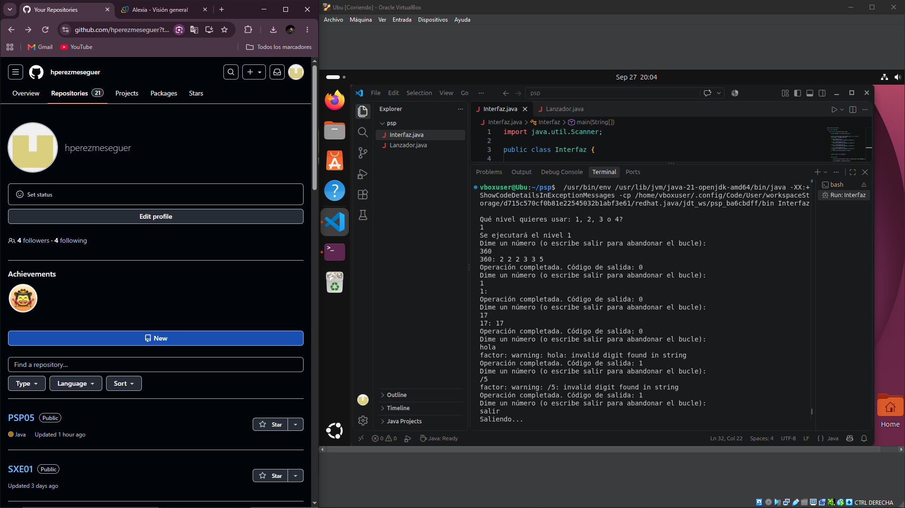
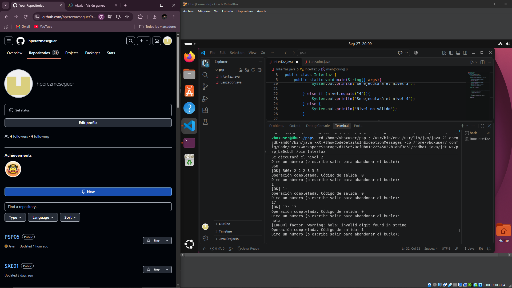
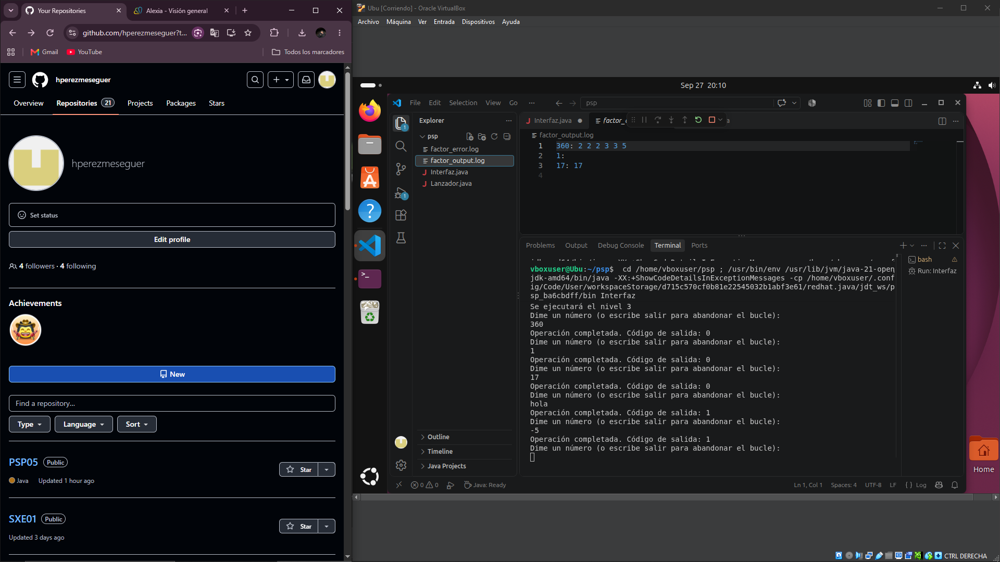
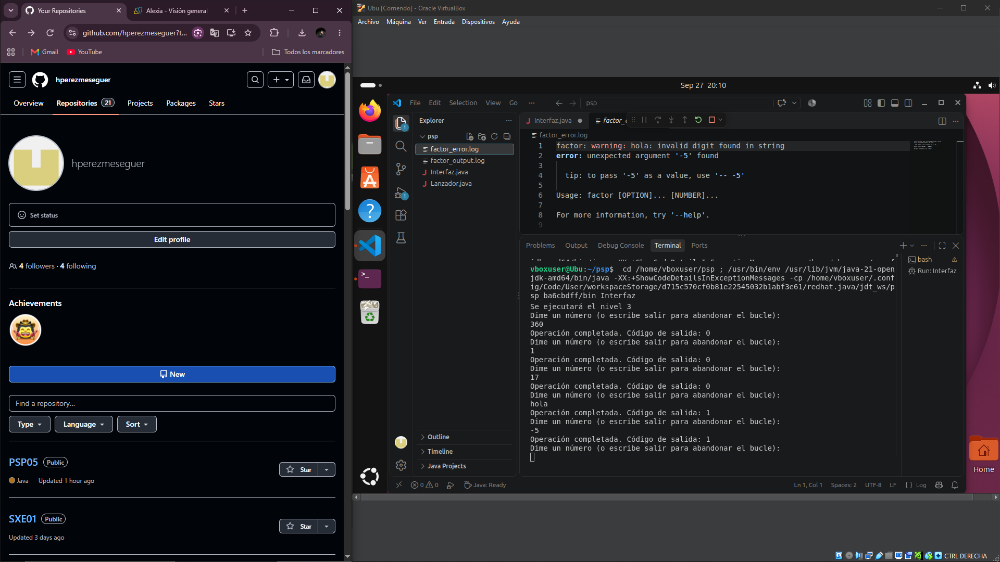
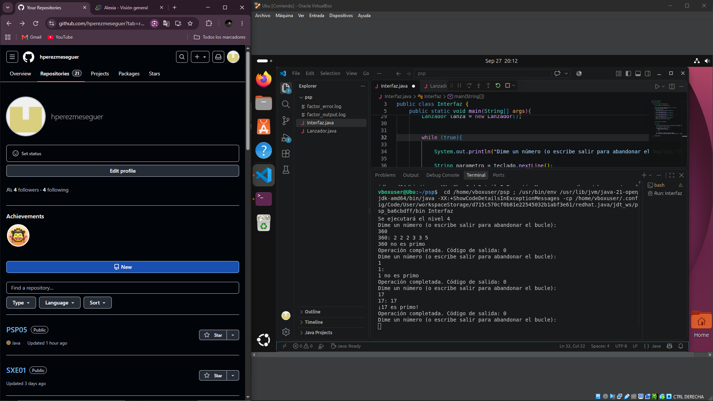

# PSP 05

# CLASE INTERFAZ

Esto fue lo que hice:

- Importación de Scanner
  
  Importo la clase Scanner para leer datos introducidos por el usuario. Luego, dentro del main, creo un objeto Scanner
  llamado "teclado", que se utiliza para leer lo que introduce el usuario vía teclado.

- Selección del nivel
  
  Primero, con un print, pido al usuario que introduzca que nivel desea utilizar. La respuesta se guarda en la variable
  "nivel" y es un String porque use nextLine(), que guarda una línea entera de texto.

  Después, con una serie de ifs, compruebo el nivel seleccionado usando "equals" porque, como dije antes, nivel es un String.
  A eso le añado un print del nivel que se ejecutará o si elige un nivel inválido.

- Objeto Lanzador
  
  Creo un objeto Lanzador llamado "lanza" que posteriormente nos permitirá llamar al método lanzar().

- Bucle de números
  
  Utilicé un bucle while (true) para que el programa pida números continuamente hasta que el usuario escriba "salir"
  por eso hay un break.
  La respuesta queda guardada en la variable "parametro".

- Llamada al método lanzar()

  Si el usuario no escribe salir, se llama a este método. Le paso dos parámetros: el nivel y el String que puso el usuario anteriormente.
  El método devuelve un int que corresponde al código de salida. Este se guarda en la variable codigoSalida y lo sigue un print.

#CLASE LANZADOR

Esto fue lo que hice:

- Método lanzar()

  Como dije antes, recibe dos parámetros: nivel y parametro. El método es de tipo int y al final devuelve un número entero.
  
  Decidí usar solo este método y usar una serie de ifs para comprobar el nivel seleccionado por el usuario. Dependiendo del nivel, se ejecuta
  un código diferente.

  Dentro de cada nivel hay una variable int codigoSalida = 0; que sirve para guardar posteriormente el código de salida del proceso. El 0
  es un valor inicial que se sustituye por el valor real al ejecutarse el waitFor() y finalmente el método devuelve ese valor a Lanzador y vuelve a Interfaz.

  También, existen try-catch que controlan errores IoException e InterrumpedException. Si se produce alguno, e.printStackTrace() muestra información
  sobre el error.

  
## Nivel 1
Esto fue lo que hice:

- Preparación del proceso
  
  Primero cree una variable llamada "proceso" de tipo ProcessBuilder para preparar la ejecución del comando factor junto con el
  número que nos dio el usuario.

  Luego, cree otra variable llamada "factorizacion" de tipo Process que guarda el resultado del proceso (.start hace que el proceso comience).

- Obtención de entrada y errores
  
  Una vez ejecutado el proceso, creo dos variables de tipo BufferedReader para leer lo que devuelve el comando factor.

  La primera variable de este tipo lee la salida que genera el proceso (factorizacion.getInputStream()), luego InputStreamReader convierte el flujo de datos en caracteres
  legibles y BufferedReader permite leer este texto línea por línea. La segunda variable, hace lo mismo, pero recibe los mensaje de error.

- Lectura de la salida
  
  Primero creo una variable de tipo String llamada linea que almacenará las líneas que se lean.

  Utilizo un while que comprueba que linea no sea null y, mientras haya contenido, siga leyendo y se siga ejecutando el bucle. Cuando ya
  no quedan más líneas, readLine() devuelve null y se termina el bucle. Posteriormente, se hace lo mismo con los errores.

- Obtención del código de salida

  Uso codigoSalida = factorizacion.waitFor(); que hace que el programa espere hasta que el proceso factor termine. Cuando termina, devuelve
  un int que se guarda en la variable codigoSalida. 0 si ha sido correcto, 1 si hay un error.

  
  

  Lo que más me costó en general, y me cuesta siempre, es empezar el programa. Estuve bastante tiempo pensando como hacerlo.

  El tema de los errores: en el while no había puesto el null y no me compilaba porque me devolvía un String y necesitaba un booleano.
  O comparar sin el equals porque como ponía un número no me acordaba de que era un String.
  Con el número 1 creo que lo hice mal y no caigo en qué y en los ficheros no se guarda el error del hola.
  Básicamente, la mayoría de errores eran olvidarme de poner ciertas cosas y/o no saber muy bien como continuar.

## Nivel 2

Usé la misma estructura, simplemente añadí en los prints en OK y el ERROR.

  

## Nivel 3

Usé de nuevo lo misma estructura. Los cambios fueron estos:

- Creación de los archivos

  Cree dos objetos de tipo PrintWriter. Con FileWriter se abre o crea el archivo y el true sirve como append, por lo que añade la nueva información
  al final del archivo sin borrar lo anterior. Funciona igual para los errores.

  También, cambié los prints del while puesto que, no son necesarios. Lo que hice fue que las líneas leídas se escribieran en sus respectivos
  archivos.

    
    
    

## Nivel 4

Usé la misma estructura, añadí estas cosas:

- Conversión a número

  Cree una variable de tipo Int que recoge "parametro" y lo convierto en int.

- Contar los divisores

  Cree otra variable llamada divisores que cuenta el número de divisores del número.

- Bucle

  Hice un bucle for que comprueba los números de 1 hasta el número introducido. En el if compruebo el resto de la división y si es 0
  auemento los divisores en uno.

- Comprobación si es primo

  Con un if compruebo si el número es mayor que 1 y si tiene dos divisores. Si solo tiene 2, es primo porque los números primos solo son divisibles
  entre ellos mismos y 1.

    

  
  
  
  
 

  
  
